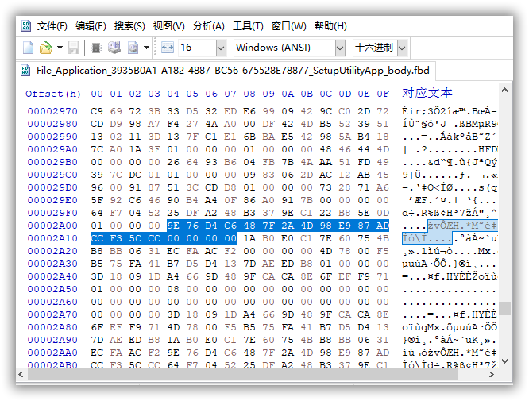

# Y7000Series_Enable_Insyde_Advanced_Settings_Mode

y7000系列解除BIOS高级设置选项限制，理论上其他的 Insyde 的 BIOS 同样适用。

## 准备工具
- [UEFITool v0.2.8 ](https://github.com/LongSoft/UEFITool/releases/tag/0.28.0)：用于提取BIOS模块
- [HxD](https://mh-nexus.de/en/downloads.php?product=HxD20)：用于修改BIOS模块
- [LEGION_Y7000Series_Insyde_Advanced_Settings_Tools](https://github.com/xiaoMGitHub/LEGION_Y7000Series_Insyde_Advanced_Settings_Tools)：用于解除BIOS校验
- [LEGION_Y7000Series_Flash_BIOS_Tools](https://github.com/xiaoMGitHub/LEGION_Y7000Series_Flash_BIOS_Tools)：用于刷写BIOS  

## 操作步骤

### 提取BIOS

方法一：  

使用工具 LEGION_Y7000Series_Flash_BIOS_Tools ，执行选项`1、备份当前 BIOS`  
执行成功后在工具目录下的`Backup`文件夹中会出现两个文件，分别是`11mb.fd`和`16mb.fd`  

方法二：  

参考 [lenovo-bios-logo-extraction-guide](https://github.com/xiaoMGitHub/lenovo-bios-logo-extraction-guide)，从 BIOS 的更新程序中提取。

### 修改BIOS（以2019款y7000为示例）

打开 UEFITool 工具，导入提取出来的`11mb.fd`文件  
  
从工具栏的`File`-`Search`进去搜索界面，点击`Text`，输入`SetupUtilityApp`，或者点击GUID，输入`3935B0A1-A182-4887-BC56-675528E78877`。y7000系列的`Advanced`等隐藏菜单是寄存在`SetupUtilityApp`中，当然不同的型号可能不一样。  
#### 为什么要搜索 SetupUtilityApp
把BIOS文件用工具处理下得到

```
0xA6B88 Form Set: Advanced [C6D4769E-7F48-4D2A-98E9-87ADCCF35CCC], ClassGuid0 [9F85453E-2F03-4989-AD3B-4A840791AF3A] {0E A7 9E 76 D4 C6 48 7F 2A 4D 98 E9 87 AD CC F3 5C CC 98 16 82 16 01 3E 45 85 9F 03 2F 89 49 AD 3B 4A 84 07 91 AF 3A}
```
然后转换下得到  

```
Advanced ：9E 76 D4 C6 48 7F 2A 4D 98 E9 87 AD CC F3 5C CC
```
然后打开 UEFITool 工具，直接搜索 `Hex pattern`即可定位到`SetupUtilityApp`，不细说这个，大概知道怎么来即可。

  

将该模块导出  
   

使用工具 HxD 编辑导出的模块  
  

模块中有⼀个表，规定了哪些项⽬可以显示在 BIOS ⾥，所以⽬标就是修改这些规定。该表的⼀部分内容如下（A/I 平台会有些许区别）：

```
79 25 62 4C 59 B5 02 46 93 E0 44 73 79 3E A2 00 01 00 00 00 Home 1st in list
3D 18 09 1D A4 66 9D 48 9F CA CA 8E 6F EF F9 71 01 00 00 00 Information 2nd in list
4D 78 00 F5 B5 75 FA 41 B7 D5 D4 13 7D AE ED B8 01 00 00 00 Configuration 3th in list
1A B0 E0 C1 7E 60 75 4B B8 BB 06 31 EC FA AC F2 00 00 00 00 Main 4th in list
9E 76 D4 C6 48 7F 2A 4D 98 E9 87 AD CC F3 5C CC 00 00 00 00 Advanced 5th in list
64 F7 04 52 25 DF A2 48 B3 37 9E C1 22 B8 5E 0D 01 00 00 00 Security 6th in list
73 28 71 A6 5F 92 C6 46 90 B4 A4 0F 86 A0 91 7B 00 00 00 00 Power 7th in list
09 83 06 2D AC 12 AB 45 96 00 91 87 51 3C CD D8 01 00 00 00 Boot 8th in list
```
注意每⾏最后 4 位（00 00 00 00 / 01 00 00 00）含 01 的就表示可以显示在 BIOS 列表⾥。

选择搜索-字节序列，这⾥⽤我们的⽬标⸺Advanced 的字节序列（⻅上）   
  

只需要把 `00 00 00 00` 改成 `01 00 00 00`  
  
保存后即可开启 Advanced 菜单  
回到 UEFITool 工具，在`3935B0A1-A182-4887-BC56-675528E78877`模块上选择 Replace，选择刚刚修改完的模块  
  
选择修改后的模块后替换，这样原来的模块加上了 Remove 的标签，我们修改的模块加上了 Replace 以示区别：  
  
保存并命名为`NewBios.bin`,因为工具 LEGION_Y7000Series_Flash_BIOS_Tools 默认的命名为该名称

### 便捷方案（感谢：[liuyishengalan](https://gist.github.com/liuyishengalan/53e022b574508c1dd84b28dac70ccd14) 提供，理论上适用于所有y7000系列型号）
新建一个`patches.txt`文本，内容如下：  

```
# Credit: liuyishengalan
# Patch string format
# FileGuid SectionType PatchType:FindPatternOrOffset:ReplacePattern 
# Please ensure that the latest symbol in patch string is space

# SetupUtilityApp | enable advance menu Lenovo Legion Y7000 2019 (Unknown for other models) 
3935B0A1-A182-4887-BC56-675528E78877 10 P:9E76D4C6487F2A4D98E987ADCCF35CCC00000000:9E76D4C6487F2A4D98E987ADCCF35CCC01000000
```
使用工具：[UEFIPatch](https://github.com/LongSoft/UEFITool/releases/download/0.28.0/UEFIPatch_0.28.0_win32.zip)  

执行命令：
```
.\UEFIPatch.exe 11mb.fd patches.txt -o NewBios.bin
```
  

## 刷写BIOS

```
LEGION_Y7000Series_Flash_BIOS_Tools 工具理论上只支持y7000系列，其他机型建议购买编程器再进行操作。
```
将修改后的BIOS文件`NewBios.bin`拷贝到`LEGION_Y7000Series_Flash_BIOS_Tools`工具目录下的`FalshBIOS`文件夹下，然后执行BIOS修改脚本的选项`2、刷写自制 BIOS`，然后耐心等待完成即可。

## 感谢
- [liuyishengalan](https://gist.github.com/liuyishengalan/53e022b574508c1dd84b28dac70ccd14) 提供的便捷修改教程
- [B站Up主：0905MC](https://www.bilibili.com/read/cv13447188?share_medium=android_i&share_plat=android&share_source=COPY&share_tag=s_i&timestamp=1633342145&unique_k=UO5RsS) 提供的原始修改教程
- [xiaoMGithub](https://github.com/xiaoMGitHub/) 提供的 BIOS 修改/刷写脚本
-  [liho98](https://github.com/liho98/lenovo-bios-logo-extraction-guide) 提供的 BIOS 文件提取方法
